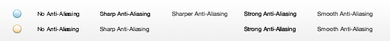
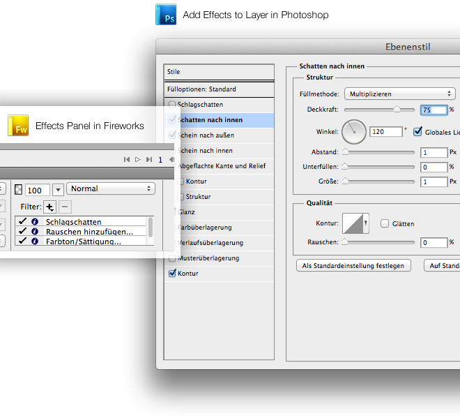

During the last months and years we have seen countless posts on popular Blogs about which application is better – Fireworks or Photoshop. In some cases this was just useless bashing of one product, whilst in other cases there were some good points regarding when and why to use one of these Applications rather than the other.

Since I launched the website ~FireworksLab~ (a free resource page for Adobe Fireworks files) some weeks ago, I have received various mails from people looking for a reason why they should use Fireworks instead of Photoshop. I have never answered any of these mails due of a lack of time but now I’m going to tell you why I use Fireworks instead of Photoshop for interface design and why you could do too – or why you should continue to use Photoshop. In addition I will show you why most of these “Fireworks vs. Photshop” posts are completely taken out of context and what I think about the Pros and Cons of both Adobe products.

## The right tool for the job

Fireworks was made to build and export web graphics in an elegant way. Following the popularity of mobile devices like the Apple iPhone it is now often used to mock up and design user interfaces for apps.

While inDesign was made only for print, Fireworks was made only for Web. Each attempt to build something for print (like a flyer or a poster) will fail from the beginning – by default (this limitation can be bypassed) your documents cannot have a higher resolution than 6000×6000 pixels and after adding some objects to your canvas, Fireworks will become slower and slower until eventually, Fireworks will crash, of course. This is one of numerous reasons why you should never use Fireworks for print (I’ve tried it more than once).

Photoshop works kinda different – you can work with CMYK-Colours, high resolutions and file sizes bigger than 2GB (the biggest Fireworks *.png I’ve ever seen was 50MB) but with Photoshop this is not a problem.

You can guess what Photoshop was made for. Correct, Photoshop was primarily built to correct and manipulate photography. While Photoshop offers many ways to manipulate photos, it has a lot of built in features that can be used for web/interface design. You can use Photoshop to produce screen graphics but also for advanced print stuff.

Photoshop became popular as a big, mighty tool for creating and manipulating digital artworks over time. Everyone knows you can do anything with Photoshop. I guess that’s the reason why so many web designers decided to learn Photoshop instead of another design application – good marketing Adobe!

## The little big differences

### Vectors or Bitmaps

When you create an object in Fireworks (whatever it is), this object is basically a vector object. This means that when you scale up or down you won’t loose any quality. This is great but even more awesome is that when you’ve applied an effect (e.g. a drop shadow) to that object and you scale the object up, the effect will scale too. Fireworks will not just change the dimensions, it will also change the attributes from the applied effects. This feature can be a huge advantage when you are designing Apps for iOS.

Photshop generally works with bitmaps, not vectors. Sure, you can create vector objects, but Photoshop is always less intuitive than Fireworks when it comes to this job. Effects in Photoshop will always stick to their attributes and won’t change their dynamic when you scale up something.

### Font Rendering

This is one of the big disadvantages of Fireworks – as a graphic design software made for the web it’s unable to render fonts as they would look in real web browsers. The default anti-aliasing settings which can also be seen on Photoshop (sharp, strong, smooth) are nearly unusable and you have to set up your own custom settings for font rendering for different fonts and different sizes.

While you can create and modify objects like rectangles or circles faster with Fireworks than with Photoshop, you end up having to play around for a long time with font rendering settings if you are working on something with many different fonts (and font sizes) and you care about how the fonts look on your design.

### Image Compression

There have already been some comparisons on the web between the image compression capabilites of Fireworks compared to Photoshop. The result: Fireworks does a better job on saving flat png files at higher quality but lower file size.

Personally, I totally don't get the point of those comparisons – when you export graphics from your primary design software for use on websites or apps you should not care about the file size. The reason behind this: there are tools which do a much, much better job when it comes to compressing graphics for the web than any Adobe software out there! While Fireworks has a good image compression technique, tools like [ImageOptim](https://imageoptim.com/mac) or the web service [PunyPNG](http://punypng.com/) will still beat it.

### Updates, Patches and Features

When reading changelogs of major releases of Fireworks you will (if you’re just a common web designer) find around three or four cool things you are happy about. In addition you will read that Adobe has added some new super ugly templates which no one uses as well as more Web 2.0 glossy gradient styles, some Flex-Export-Thingy (that the majority of users never need) and enhanced (but still not usable) CSS-Export.

Here are some examples of what could be really useful features for the common Fireworks user:

- Mac Trackpad Support
- Insert layer styles directly as CSS3, export Layer styles directly as CSS3
- Folders for Pages
- Improved Layer styles and/or better integration of Photoshop Live-Filters
- Bugfixes!

I get jealous when I see which new features Photoshop-designers implement with every new major release of Photoshop – cool things like content aware fill, smooth edge detection or live colour comparisons.

### Stability & Bugs

Fireworks definitely crashes more of often than Photoshop but actually I can see the light at the end of the tunnel. Since the release of Creative Suite 5, Fireworks chrashes less than in previous versions. I’ve also noticed the Mac version is way more stable than Fireworks for Windows.

Regarding the Bugs… you fill find a lot of them in Fireworks, they are simply part of the product. You have to learn how to avoid them and how to fix your document when they destroy parts of your design. After some time you will be familiar with most of them and you will know how to bypass them.

Photoshop also contains some bugs but it’s way more bug free than Fireworks.

### Developer-friendliness

A big advantage of Fireworks is it’s simplcity and how it handles selection of layers. Photoshop files can become very messy when you want to design fast. If you don’t clean up your files at the end of your work it will be really hard for the developer to find the correct layers and groups to export.

I have worked with several web and app developers and all of them learned the basics of Adobe Fireworks (in general that’s selecting, dragging and exporting) in less than ten minutes. Trying to explain to a total newbie (and non-designer) how to handle layers and countless masks in Photoshop can become a day job.

### User Interface and User Experience

While Fireworks looks like an Adobe product, it still feels like something made by Macromedia. The overall style of the UI is the same in PS and FW since CS4 but the way the user interacts with the app feels totally different.

Overall, both Fireworks and Photoshop have the common elements every graphic design software has: tools, layers and a lot of windows/panels for colours, gradients, vector tools and much more. In my eyes there are only two huge differences between both apps: the way they to apply effects to objects/layers and how they work with gradients.

### Effects

In Photoshop there is one common way to apply effects to a layer: you click the Add effects in Photoshop-symbol and a window pops up which allows you to apply and change all the effects for the layer. You can apply one effect once to one layer.

In Fireworks there is a totally different way to work with effects. You can apply them via the properties panel in the effects section which you always open. To add an effect, click the “+” and choose your effect. Adjust all the settings for the effect and be happy. No extra windows or dialog boxes. I think the way that Fireworks handles this is much more intuitive than the way Photoshop does. More great things: you can apply the same effect as often as you want and you can’t just delete your effects.

### Gradients

In Photoshop, gradients are handled as simple effects. You can apply them like all other effects via clicking “fx“. There you have the settings and you can play around with these to achieve your desired result.

In Fireworks gradients are not applied as effects but as gradients! There is a main section dedicated to gradient settings. After you’ve applied a gradient to an object you can drag, cut, rotate and squeeze gradients via the gradient handler – a special control that is used only in Fireworks.

## Finally, should I switch?

If you have worked your whole life with Photoshop then lot of things will look unfamiliar to you in Fireworks. The same is true for Fireworks power users who try to use Photoshop for the first time.

In terms of user interface design, I think Fireworks is just the right tool for the job. If you have never worked with Fireworks before, just give it a try, watch some tutorial videos and try out some simple stuff. If you still think you can achieve better results faster with Photoshop, then just stick to Photoshop.

This advice also applies to actual users of Fireworks: you shouldn’t think that Fireworks is the best piece of software and that there will never be a better tool to get the job done. Personally I love to use Fireworks for Web and UI Design but when it comes to illustrations, icons or something to print I think it’s better to drop your good ol’ friend and start learning something new.

